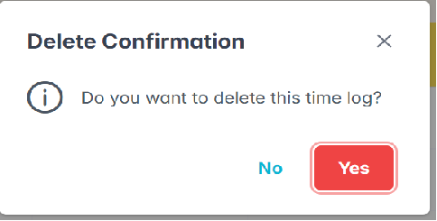
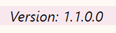

# **Time Log Application ⏱**

> A time log application using PrimeReact, allowing users to track their time spent on various tasks. In this updated version, several features are added in order to enhance the user experince as they use the app. Some of the features added is a search functionality. This application utilizes the local storage for storing data's received from the users and implemented some React hooks such as `useState` and `useEffect`.

## To _Run_ the Application

1. To run the application, simply launch the terminal and enter `npm start`.

2. The application then will be displayed in the selected browser either edge or chrome.

## Assignment 1 
### Features Implemented

### A Time Log Entry.

Users may enter the task particulars which includes task name, start time, end time, and a date. The task particulars can be enterd inside the textboxes right above the _Add New_ button.

<div align="center">
    
    <p>Input Boxes</p>
</div>

### Delete a Time Log Entry.

The delete button will appear on each row of the table alongside the data provided in a table, allowing the users to be able to _delete_ the log added to the list by row.
The delete button works as deleting data in a row.

<div align="center">
    
    <p>Delete Button</p>
</div>

### Display the Time Logs.

The time log added by the users will be displayed in the format of a table right bellow the submit button. It will display all the data entered by user together with a duration and a delete button.

<div align="center">
    
<p>Time Log List Table</p>
</div>

### Duration for Each Task.

The users need to enter the task start time and their end time for it to calculate the total duration in minutes.

```
    const diff = (end - start) / 1000 / 60;
```
<p align="center">Part of code to calculate the duration and convert it to minutes.</p>


## Assignment 1.1
### Refactor Existing Time Log

### PrimeReact Installation

1. Launch PrimeReact website.  
    [PrimeReact] {https://primereact.org/installation/}  

2. Enter `npm install primereact` in the terminal.
  

### PrimeReact Usage

- Each component can be imported individually.
- Import path is available in the documentation of the corresponding component.
<br>
    ```
  Example :
            import React from 'react'; 
            import { Button } from 'primereact/button';

            export default function BasicDemo() {
                return (
                    <div className="card flex justify-content-center">
                        <Button label="Check" icon="pi pi-check" />
                    </div>
                )
            }
  ```      

### Updated Version

- App.js
  - Introduced a card component in order to have a more appealing and structured appearance.  
    
    <br>

- AddTimeLogForm.js
  - Replaced the plain text box input together with the add new button with PrimeReact components for a more interactive and better user interaction.
    <div align="center">
        
    <p>Input box</p>
    </div>
  - All activities, including adding a new time log and deleting a time log, will have a toast prompt to keep the user aware of their activities.
    <div align="center">
        
    <p>Add new time log activity</p>
    </div>  
    
    <br>

- TimeLogList.js
  - Implemented sorting and pagination to display the time logs in a proper manner.
      <div align="center">
        
    <p>Filter component for each header</p>
    </div>
    <div align="center">
        
    <p>Pagination</p>
    </div>  
    
    <br>

- TimeLogItem.js
  - Replaced the delete button with PrimeReact component.
    <div align="center">
        
    <p>Input box</p>
    </div>
    - Applied a confirmation dialog along with a toast for deletion activity to avoid accidental deletion of logs.
    <div align="center">
        
    <p>Confirmation dialog</p>
    </div>
    <div align="center">
        
    <p>Delete toast</p>
    </div>  
    
    <br>

- Responsive Styling
  - Adapted the styling to be responsive to work on different screen sizes.
  - The data table will be scrollable from left to right as the screensize shrink smaller.
    <div align="center">
        <div style="display: flex; justify-content: center;">
            
            
        </div>
        <p>Medium Screen Size</p>
    </div>

    <br>

    <div align="center">
        <div style="display: flex; justify-content: center;">
            
            
        </div>
        <p>Small Screen Size</p>
    </div>

    <br>

- Functionality
  - Implemented filtering ability.
        <div align="center">
        
    <p>Search function</p>
    </div>

  - Added a search function to allow users to find time logs conveniently.
      <div align="center">
        
    <p>Search function</p>
    </div>

    <br>

- Environment Configuration
    - Added a software version in the .env file.
    - Displayed it in the application footer.
        <div align="center">
            
            <p>Software version in footer</p>
        </div>
  <br>

## Challenges Faced

Encountered several issues and challenges along the way to completing the application:

- Getting familiarized with the PrimeReact and PrimeFlex library.
- Difficulties in styling the delete button as it sits on a table.
- Filtering not working for some letters as used in time (a, m, p)
- Adding a search function.
- Making the layout of the app to be responsive.
- To write updates in Changelog.
- To write the software version in the .env file and display it at the application footer.
- 