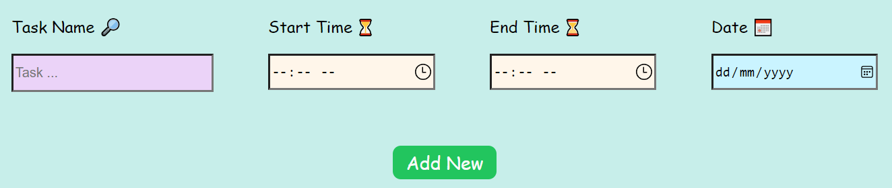
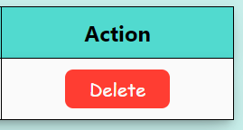
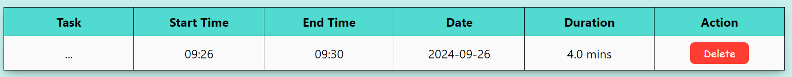

# **Time Log Application ⏱**

> A time log application using React that will allow users to track their time spent on various tasks. This application utilizes the local storage for storing data's received from the users and implemented some React hooks such as useState and useEffect.

## To _Run_ the Application

To run the application, simply launch the terminal and enter ``npm start``.

```
npm start
```

The application then will be displayed in the selected browser either edge or chrome.

## Features Implemented

### A Time Log Entry.

Users may enter the task particulars which includes task name, start time, end time, and a date. The task particulars can be enterd inside the textboxes right above the _Add New_ button.

<div align="center">
    
    <p>Input Boxes</p>
</div>

### Delete a Time Log Entry.

The delete button will appear on each row of the table alongside the data provided in a table, allowing the users to be able to _delete_ the log added to the list by row.
The delete button works as deleting data in a row.

<div align="center">
    
    <p>Delete Button</p>
</div>

### Display the Time Logs.

The time log added by the users will be displayed in the format of a table right bellow the submit button. It will display all the data entered by user together with a duration and a delete button.

<div align="center">
    
<p>Time Log List Table</p>
</div>

### Duration for Each Task.

The users need to enter the task start time and their end time for it to calculate the total duration in minutes.

```
    const diff = (end - start) / 1000 / 60;
```
<p align="center">Part of code to calculate the duration and convert it to minutes.</p>

## Challenges Faced

Encountered several issues and challenges along the way to complete the application as :

- Issues with storing an array in local storage.
- The need of stringify to store the data in the local storage.
- Figuring out to map an array.
- Issues in displaying log list due to capitalization inconsistency.
- Issue with the delete button functionality.
- To get familiarized with a different CSS library.
- To write the README file upon completing the application.
